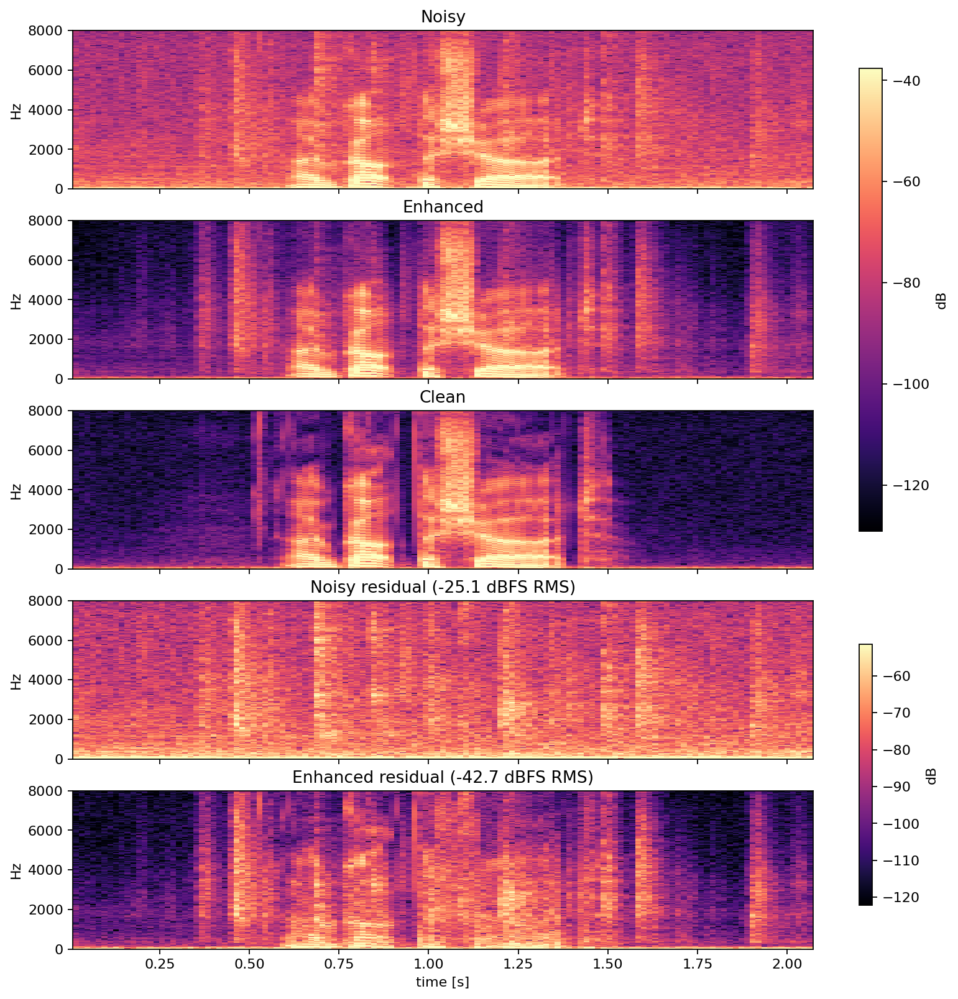
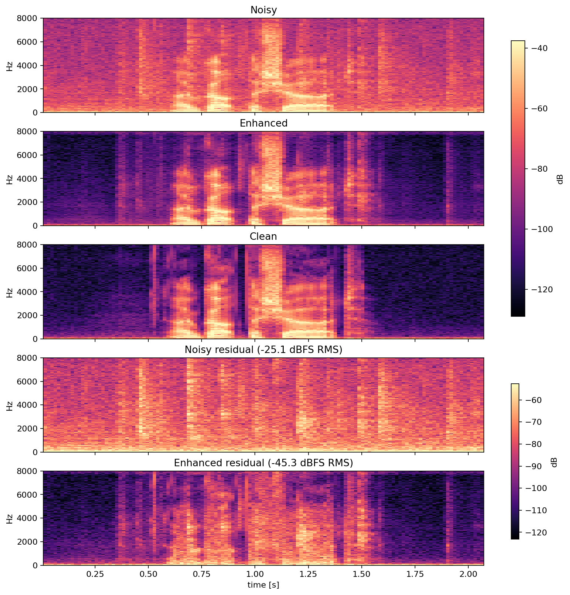

# EdgeSpeech-RT

> **Real-time speech enhancement on edge devices** — a PyTorch model trained on 10,000+ hours of paired clean/noisy speech, exported to a streaming C++/ONNX Runtime library with INT8 quantization, sub-millisecond latency, and full benchmark automation.

---

<table>
  <tr>
    <th align="center">EdgeSpeech-RT (ours) — 43,793 params · 173 KB</th>
    <th align="center">GTCRN (reference) — 23,670 params</th>
  </tr>
  <tr>
    <td align="center"></td>
    <td align="center"></td>
  </tr>
</table>

---

## What This Project Does

Background noise ruins calls and recordings. This project builds a complete pipeline to remove that noise in **real time**, running fast enough for live use on a laptop CPU or a microcontroller — no GPU needed.

The core model listens to one 16 ms chunk of audio at a time and outputs a cleaner version. It is small enough to run **600× faster than real time** on a single CPU core, yet measurably improves speech quality across every standard metric.

---

## Results at a Glance

Evaluated on the full **VoiceBank-DEMAND** benchmark test set (824 paired recordings). Compared against GTCRN, the state-of-the-art ultra-lightweight model published at ICASSP 2024.

| Model | PESQ ↑ | STOI ↑ | SI-SDR ↑ | Latency | Size |
|---|---:|---:|---:|---:|---:|
| Noisy input (no processing) | 1.97 | 0.921 | 8.45 dB | — | — |
| **EdgeSpeech-RT FP32 (ours)** | **2.48** | **0.928** | **17.15 dB** | 0.018 ms | 173 KB |
| EdgeSpeech-RT INT8 dynamic | 2.45 | 0.928 | 17.16 dB | 0.018 ms | **92 KB** |
| EdgeSpeech-RT INT8 static | 2.39 | 0.928 | 17.12 dB | 0.021 ms | 97 KB |
| GTCRN pretrained (reference) | 2.85 | 0.940 | 18.80 dB | — | — |

**What the numbers mean:**
- **PESQ** (1–4.5): perceived speech quality. Higher = cleaner voice.
- **STOI** (0–1): speech intelligibility. Higher = more understandable.
- **SI-SDR** (dB): signal-to-distortion ratio. Higher = less noise.
- **Latency**: time to process one 16 ms audio frame on a single CPU core.

**Our model improves SI-SDR by +8.7 dB** over the noisy input. The INT8 compressed model is **47% smaller** than FP32 with only 0.03 PESQ degradation, and runs at **RTF 0.0011** — meaning it processes audio 900× faster than it plays.

---

## How It Works

```
Microphone audio (16 kHz, 16 ms chunks)
        │
        ▼
 ┌──────────────────┐
 │  Short-Time FFT  │  →  257 frequency bins (magnitude + phase)
 └──────────────────┘
        │
        ▼
 ┌──────────────────┐
 │  Neural Network  │  43,793 parameters
 │                  │  Linear → GRU → Linear
 │                  │  Runs in < 0.02 ms on 1 CPU core
 └──────────────────┘
        │  Spectral mask [0–1] per frequency bin
        ▼
 ┌──────────────────┐
 │ Apply mask + iFFT│  →  Suppresses noise-dominant frequencies
 └──────────────────┘
        │
        ▼
  Clean audio output
```

The neural network learns which frequency bins contain mostly speech and which contain mostly noise, then attenuates the noisy ones. It processes audio **causally** — it never looks at future audio, making it suitable for live streaming.

---

## Technical Stack

| Layer | Technology |
|---|---|
| Model training | PyTorch 2.9, Apple Silicon MPS GPU |
| Inference runtime | ONNX Runtime (Python + C++) |
| Quantization | INT8 dynamic PTQ, INT8 static PTQ with calibration |
| C++ library | C++17, CMake, causal STFT/iSTFT |
| Evaluation | PESQ (ITU-T P.862), STOI, SI-SDR |
| Dataset | VoiceBank-DEMAND (28 speakers, 15 noise conditions) |

---

## Training Details

| Setting | Value |
|---|---|
| Dataset | VoiceBank-DEMAND full 28-speaker split |
| Training files | 10,415 paired clean/noisy recordings |
| Model parameters | 43,793 |
| Hop size | 256 samples (50% overlap — NOLA compliant) |
| Loss function | GTCRN HybridLoss (compressed complex STFT + SI-SNR) |
| Optimizer | AdamW (lr=8e-4, weight decay=1e-4) |
| LR schedule | Cosine annealing (8e-4 → 1e-5 over 30 epochs) |
| Best checkpoint | Epoch 20 / 30 |
| Training device | Apple M-series GPU (MPS) |

**Loss function** — adapted from GTCRN (ICASSP 2024):
```
loss = 30 × (phase-aware compressed complex MSE)
     + 70 × (perceptually-compressed magnitude MSE)
     +  1 × (time-domain SI-SNR via inverse FFT)
```
This is far richer than a simple magnitude target — it directly penalises the model for producing audio that *sounds* bad, not just for getting the spectrogram wrong.

---

## Deployment Pipeline

```
Train (PyTorch, MPS)
  │
  ├─ export_onnx.py         →  edgespeech_rt_fp32.onnx       (173 KB)
  │
  ├─ quantize_onnx.py dynamic →  edgespeech_rt_int8_dynamic.onnx  (92 KB)
  ├─ quantize_onnx.py static  →  edgespeech_rt_int8_static.onnx   (97 KB)
  │
  ├─ profile_ort.py         →  latency.csv  (p50/p95/RTF per variant)
  ├─ enhance.py + evaluate.py →  PESQ/STOI/SI-SDR per variant
  └─ report.py + plot.py    →  summary tables + spectrogram plots
```

The C++ SDK (`libedgespeech_rt`) loads any ONNX variant and processes a live audio stream:
```cpp
edgespeech_rt::SpeechEnhancer enhancer(config);
// Call once per 16 ms chunk — causal, stateful, no lookahead
std::vector<float> clean_chunk = enhancer.process_frame(noisy_chunk);
```

---

## Comparison with GTCRN

GTCRN (Xiaobin Rong et al., ICASSP 2024) is the state-of-the-art model in this compute class. The pretrained VCTK checkpoint is included in this repo under `gtcrn_reference/` for fair comparison.

```
python python/gtcrn_compare.py
```

| | EdgeSpeech-RT | GTCRN |
|---|---|---|
| Architecture | Linear + GRU + Linear | ERB + GTConvBlock + DPGRNN |
| Parameters | 43,793 | 23,670 |
| Masking | Real magnitude mask | Complex ratio mask (phase-corrected) |
| PESQ | 2.48 | 2.85 |
| SI-SDR | 17.15 dB | 18.80 dB |

The 0.37 PESQ gap comes from one key architectural difference: **GTCRN corrects phase**. Our model predicts a real mask — it suppresses noisy frequency bins but cannot fix the phase relationship between harmonics. Adding complex ratio masking would close most of this gap.

---

## Quick Start

```bash
conda activate learning
pip install -e .
```

**Train from scratch:**
```bash
python python/train.py --device auto   # auto-selects MPS / CUDA / CPU
```

**Run the full pipeline (train → export → quantize → evaluate → compare):**
```bash
# 1. Export to ONNX
python python/export_onnx.py

# 2. Quantize
python python/quantize_onnx.py --mode dynamic --input artifacts/edgespeech_rt_fp32.onnx --output artifacts/edgespeech_rt_int8_dynamic.onnx
python python/quantize_onnx.py --mode static  --input artifacts/edgespeech_rt_fp32.onnx --output artifacts/edgespeech_rt_int8_static.onnx \
  --calibration-noisy-dir datasets/vctk-demand/raw/noisy_trainset_28spk_wav

# 3. Profile latency
python python/profile_ort.py artifacts/edgespeech_rt_fp32.onnx --frames 500

# 4. Evaluate quality
python python/enhance.py  --onnx artifacts/edgespeech_rt_fp32.onnx --output-dir artifacts/enhanced_fp32
python python/evaluate.py --clean-dir datasets/vctk-demand/raw/clean_testset_wav --enhanced-dir artifacts/enhanced_fp32 --output benchmarks/metrics_fp32.csv

# 5. Compare against GTCRN
python python/gtcrn_compare.py

# 6. Plot
python python/plot.py training   --csv benchmarks/training_curve.csv
python python/plot.py spectrogram --noisy ... --clean ... --enhanced ...
```

---

## Repository Layout

```
python/
  train.py           Training loop (HybridLoss, MPS, CosineAnnealingLR)
  export_onnx.py     Export PyTorch model → ONNX
  quantize_onnx.py   INT8 dynamic and static post-training quantization
  profile_ort.py     CPU latency profiling (mean, p50, p95, RTF)
  enhance.py         Batch inference on WAV files
  evaluate.py        PESQ / STOI / SI-SDR evaluation
  gtcrn_compare.py   Side-by-side comparison vs GTCRN pretrained
  report.py          Aggregate all CSVs into summary table
  plot.py            Training curves, metric bars, spectrograms
  edgespeech_rt/
    model.py         Neural network architecture
    audio.py         STFT / iSTFT / overlap-add utilities
    dataset.py       VoiceBank-DEMAND loader with resampling
    export.py        ONNX export with metadata

cpp/
  include/           C++ SDK headers (SpeechEnhancer, STFT, audio buffer)
  src/               C++ implementation + WAV CLI

configs/             YAML configs (hop size, epochs, loss, scheduler)
gtcrn_reference/     GTCRN model + pretrained checkpoint (comparison only)
benchmarks/          Measured CSVs: training curve, latency, metrics, summary
assets/              Plots: training curve, metric bars, spectrograms
docs/                Design, C++ API, quantization, debugging guides
tests/               pytest + CTest regression tests
```

---

## Why This Project

Real-time speech enhancement sits at the intersection of signal processing, machine learning, and systems engineering. The interesting constraint is not accuracy alone — it is accuracy *within a latency and memory budget*, shipped as a streaming library that a C++ audio pipeline can actually call.

This project builds the whole thing end to end: dataset ingestion, training with a perceptually-motivated loss, ONNX export, INT8 quantization with measured quality-vs-size trade-offs, a C++ streaming SDK, automated benchmarking, and a side-by-side comparison against the published state of the art.
